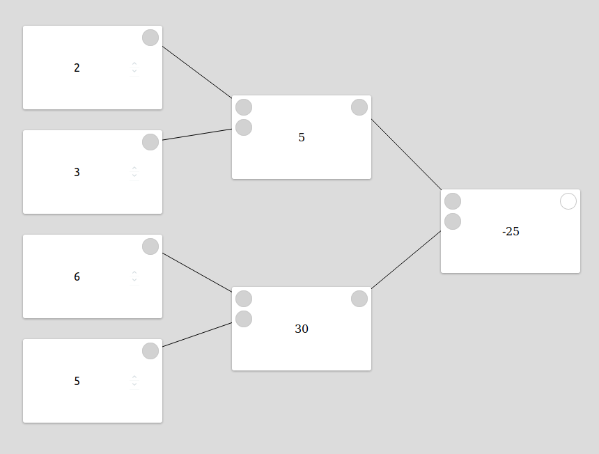

# flow-logic

FlowLogic is a low level EmberJS addon that gives you the ability to create editors and representations of complex logical systems.
Possible use cases include:
* graphical representation of a domain specific language
* planniung of a microservice architecture
* shader editor
* image/batch editor

The above image gives you a first glimpse of the power of FlowLogic: It is depicked of our upcomming tutorial series and shows a simple calculator where numbers and operations are represented by graphical blocks. It calculates the result of 2 + 3 - (6 * 5). Changing the values of the input numbers will end in a new result

## Installation

* `git clone <repository-url>` this repository
* `cd flow-logic`
* `npm install`

## Running

* `ember serve`
* Visit your app at [http://localhost:4200](http://localhost:4200).

## Running Tests

* `npm test` (Runs `ember try:each` to test your addon against multiple Ember versions)
* `ember test`
* `ember test --server`

## Building

* `ember build`

For more information on using ember-cli, visit [https://ember-cli.com/](https://ember-cli.com/).
2
